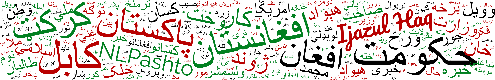

# NLPashto – NLP Toolkit for Pashto
  

NLPashto is a Python suite for Pashto Natural Language Processing, which includes tools for fundamental text processing tasks, such as text cleaning, tokenization, and chunking (word segmentation). It also includes state-of-the-art models for POS tagging and sentiment analysis (offensive language detection, to be specific).

**Citation**
```
@article{haq2023nlpashto,
  title={NLPashto: NLP Toolkit for Low-resource Pashto Language},
  author={Ijazul Haq and Weidong Qiu and Jie Guo and Peng Tang},
  journal={International Journal of Advanced Computer Science and Applications},
  volume={14},
  number={6},
  pages={1345-1352},
  year={2023},
  issn={2156-5570},
  doi={https://dx.doi.org/10.14569/IJACSA.2023.01406142}
  publisher={Science and Information (SAI) Organization Limited}
}
```

## Prerequisites
To use NLPashto you will need:
* Python 3.8+

## Installing NLPashto
NLPashto can be installed from GitHub source or from PyPi hub simply by running this command:

```bash
pip install nlpashto
```

## Basic Usage

### Text Cleaning
This module contains basic text cleaning utilities, which can be used as follows:

```python
from nlpashto import Cleaner
cleaner=Cleaner()
noisy_txt= “په ژوند کی علم  📚📖 , 🖊  او پيسي 💵.  💸💲 دواړه حاصل کړه پوهان به دی علم ته درناوی ولري اوناپوهان به دي پیسو ته… https://t.co/xIiEXFg”

cleaned_text=cleaner.clean(noisy_txt)
print(cleaned_text)
Output:: په ژوند کی علم , او پيسي دواړه حاصل کړه پوهان به دی علم ته درناوی ولري او ناپوهان به دي پیسو ته

```
The clean method has several parameters you can play with:

* `text`=None | str or list | the input noisy text that you want to clean.
* `split_into_sentences`=True | bool | whether the text should be split into sentences or not.
* `remove_emojis`=True | bool | whether emojis should be removed or not.
* `normalize_nums`=True | bool | If set to True, Arabic numerals (1,2,3,…) will be normalized to Pashto numerals (۱،۲،۳،...).
* `remove_puncs`=False | bool | If set to True, punctuations (.,”,’,؟ etc.) will be removed.
* `remove_special_chars`=True | bool | If set to True, special characters (@,#,$,% etc.) will be removed.
* `special_chars`=[ ] | list | A list of special characters that you want to keep in the text.

### Tokenization (Space Correction)
This module can be used to correct space omission and space insertion errors. It will remove extra spaces from the text and insert space where necessary. It is basically a supervised whitespace tokenizer, but unlike the split() function of Python, the NLPashto Tokenizer is aware of the correct position of whitespace in the text. It is essentially a CRF model, trained on a corpus of ≈200K sentences. For further detail about this model, please refer to our paper,  [Correction of whitespace and word segmentation in noisy Pashto text using CRF]( https://linkinghub.elsevier.com/retrieve/pii/S0167639323001048).

```python
from nlpashto import Tokenizer
tokenizer=Tokenizer()
noisy_txt='جلال اباد ښار کې هره ورځ لس ګونه کسانپهډلهییزهتوګهدنشهيي توکو کارولو ته ا د ا م ه و رک وي'
tokenized_text=tokenizer.tokenize(noisy_txt)
print(tokenized_text)
Output:: [['جلال', 'اباد', 'ښار', 'کې', 'هره', 'ورځ', 'لسګونه', 'کسان', 'په', 'ډله', 'ییزه', 'توګه', 'د', 'نشه', 'يي', 'توکو', 'کارولو', 'ته', 'ادامه', 'ورکوي']]
```

### (Chunking) Word Segmentation
If we look at the above example, we can see that the Tokenizer has split the compound words, `جلال اباد`, `ډلي ييزه`, and `نشه يي` into meaningless sub-parts. In such cases, where retrieval of the full word is necessary (instead of space-delimited tokens), we can use NLPashto Segmenter class. The word segmentation model is based on transformers, available on HuggingFace [ijazulhaq/pashto-word-segmentation](https://huggingface.co/ijazulhaq/pashto-word-segmentation). 

```python
from nlpashto import Segmenter

segmenter=Segmenter()
#we are passing the above tokenized text to word segmenter
segmented_text=segmenter.segment(tokenized_text)
print(segmented_text) 
Output:: [['جلال اباد', 'ښار', 'کې', 'هره', 'ورځ', 'لسګونه', 'کسان', 'په', 'ډله ییزه', 'توګه', 'د', 'نشه يي', 'توکو', 'کارولو', 'ته', 'ادامه', 'ورکوي', '']]
```

To segment multiple sentences, it’s better to specify the batch size by passing it to the class constructor, as below:
```python
segmenter=Segmenter(batch_size=32) # by default it’s 16
```
### Part-of-speech (POS) Tagging
For a detailed explanation about the POS tagger, tagset, and the dataset used for training the model, please have a look at our paper [POS Tagging of Low-resource Pashto Language: Annotated Corpus and Bert-based Model](https://www.researchsquare.com/article/rs-2712906/v1). This is also a transformer-based model, available on HuggingFace [ijazulhaq/pashto-pos](https://huggingface.co/ijazulhaq/pashto-pos).
```python
from nlpashto import POSTagger
pos_tagger=POSTagger()
pos_tagged=pos_tagger.tag(segmented_text)
print(pos_tagged)
Output:: [[('جلال اباد', 'NNP'), ('ښار', 'NNM'), ('کې', 'PT'), ('هره', 'JJ'), ('ورځ', 'NNF'), ('لسګونه', 'JJ'), ('کسان', 'NNS'), ('په', 'IN'), ('ډله ییزه', 'JJ'), ('توګه', 'NNF'), ('د', 'IN'), ('نشه يي', 'JJ'), ('توکو', 'NNS'), ('کارولو', 'VBG'), ('ته', 'PT'), ('ادامه', 'NNF'), ('ورکوي', 'VBP')]]
```
The tag method takes a list of segmented sentences as input and returns a List of Lists of tuples where the first element in the tuple is the word and the second element is the corresponding POS tag.

### Sentiment Analysis (Offensive Language Detection)
NLPashto toolkit includes a state-of-the-art model for offensive language detection. It is a fine-tuned PsBERT model, which directly predicts text toxicity without translating it. It takes a sequence of text as input and returns 0 (normal) or 1 (offensive/toxic). For further detail, please read our paper, [Pashto offensive language detection: a benchmark dataset and monolingual Pashto BERT](http://dx.doi.org/10.7717/peerj-cs.1617). 

```python
from nlpashto import POLD
sentiment_analysis=POLD()
offensive_text='مړه یو کس وی صرف ځان شرموی او یو ستا غوندے جاهل وی چې قوم او ملت شرموی'
sentiment=sentiment_analysis.predict(offensive_text)
print(sentiment)
Output:: 1

normal_text='تاسو رښتیا وایئ خور 🙏'
sentiment=sentiment_analysis.predict(offensive_text)
print(sentiment)
Output:: 1
```
## Other Resources
#### BERT (WordPiece Level)
Pretrained Pashto BERT model (PsBERT), available on HuggingFace, [ijazulhaq/bert-base-pashto](https://huggingface.co/ijazulhaq/bert-base-pashto)
#### BERT (Character Level)
Pretrained Pashto BERT model (character-level), available on HuggingFace, [ijazulhaq/bert-base-pashto-c](https://huggingface.co/ijazulhaq/bert-base-pashto-c)
#### Static Word Embeddings
For Pashto, we have pretrained 3 types of static word embeddings, available at this repository [pashto-word-embeddings](https://github.com/ijazul-haq/ ). 
* Word2Vec
* fastText
* GloVe
#### Examples and Notebooks
For related examples and Jupyter Notebooks please visit our [Kaggle profile](https://www.kaggle.com/drijaz/) 
#### Datasets and Text Corpora
Sample datasets are available on our [Kaggle profile](https://www.kaggle.com/drijaz/), and the full version of the datasets and annotated corpora can be provided on request.

## Contact
- LinkedIn: [https://www.linkedin.com/in/drijaz/](https://www.linkedin.com/in/drijaz/) 
- Email: [ijazse@hotmail.com](mailto:ijazse@hotmail.com)

## Citations
Please cite our work if you are using this code or toolkit for learning or any other purpose.

**For NLPashto ToolKit**

_H. Ijazul, Q. Weidong, G. Jie, and T. Peng, "NLPashto: NLP Toolkit for Low-resource Pashto Language," International Journal of Advanced Computer Science and Applications, vol. 14, pp. 1345-1352, 2023._

```
@article{haq2023nlpashto,
  title={NLPashto: NLP Toolkit for Low-resource Pashto Language},
  author={Ijazul Haq and Weidong Qiu and Jie Guo and Peng Tang},
  journal={International Journal of Advanced Computer Science and Applications},
  volume={14},
  number={6},
  pages={1345-1352},
  year={2023},
  issn={2156-5570},
  doi={https://dx.doi.org/10.14569/IJACSA.2023.01406142}
  publisher={Science and Information (SAI) Organization Limited}
}
```

**For Tokenization, Space Correction and Word segmentation**

_H. Ijazul, Q. Weidong, G. Jie, and T. Peng, "Correction of whitespace and word segmentation in noisy Pashto text using CRF," Speech Communication, vol. 153, p. 102970, 2023._

```
@article{HAQ2023102970,
  title={Correction of whitespace and word segmentation in noisy Pashto text using CRF},
  journal={Speech Communication},
  volume={153},
  pages={102970},
  year={2023},
  issn={0167-6393},
  doi={https://doi.org/10.1016/j.specom.2023.102970},
  url={https://www.sciencedirect.com/science/article/pii/S0167639323001048},
  author={Ijazul Haq and Weidong Qiu and Jie Guo and Peng Tang},
}
```

**For POS Tagger and Tagset**

_H. Ijazul, Q. Weidong, G. Jie, and T. Peng, "POS Tagging of Low-resource Pashto Language: Annotated Corpus and Bert-based Model," preprint https://doi.org/10.21203/rs.3.rs-2712906/v1, 2023._

```
@article{haq2023pashto,
  title={POS Tagging of Low-resource Pashto Language: Annotated Corpus and Bert-based Model},
  author={Ijazul Haq and Weidong Qiu and Jie Guo and Peng Tang},
  journal={preprint https://doi.org/10.21203/rs.3.rs-2712906/v1},
  year={2023}
}
```

**For Sentiment Classification, Offensive Language Detection, and pretrained Pashto BERT model (PsBERT)**

_H. Ijazul, Q. Weidong, G. Jie, and T. Peng, "Pashto offensive language detection: a benchmark dataset and monolingual Pashto BERT," PeerJ Comput. Sci., 2023._

```
@article{haq2023pold,
  title={Pashto offensive language detection: a benchmark dataset and monolingual Pashto BERT},
  author={Ijazul Haq and Weidong Qiu and Jie Guo and Peng Tang},
  journal={PeerJ Comput. Sci.},
  year={2023},
  issn={2376-5992},
  doi={http://doi.org/10.7717/peerj-cs.1617}
}
```
